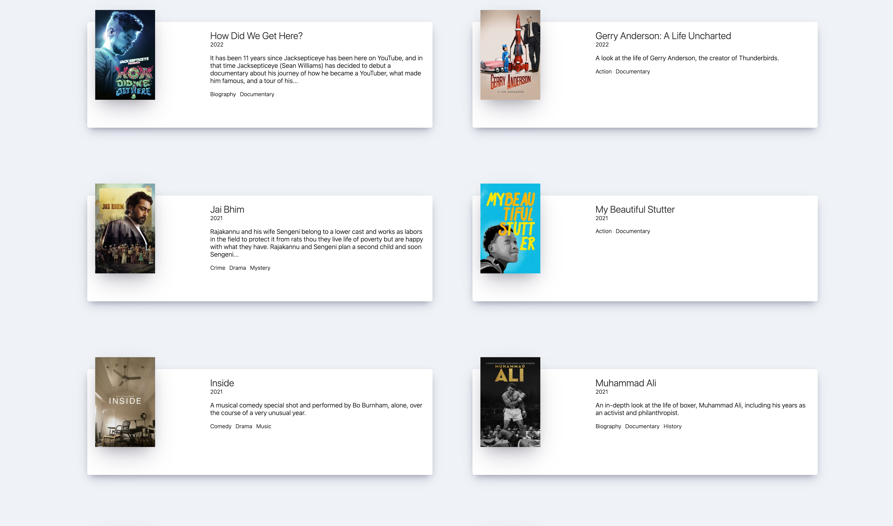

<h1 align="center"> Movie App </h1>
<div align="center">
React 연습을 위한 영화 정보 웹사이트 
  
<p>
  
</p>
  
[](https://jaeelee.github.io/movie_app/)

</div>

## Author

👤 **jaeelee**

* Github: [@jaeelee](https://github.com/jaeelee)

## Tech Stack

**Client:** ReactJS, JavaScript

## DOCS

### react-router

#### 1. 설치 
```npm insall react-router-dom``` 
OR 
```npm i react-router-dom@5.3.0```

#### 2. import 하기
```
import {
  BrowserRouter as Router,
  Routes,
  Route,
} from "react-router-dom";
```

### gs-pages
- 결과물을 github pages에 업로드 할 수 있게 해주는 패키지
#### 1. 설치 
```npi i gh-pages```
#### 2. package.json에 추가
```json

  "scripts": {
    ...
    "deploy": "gh-pages -d build",
    "predeploy": "npm run build" //deploy하기 전 실행되는 명령어
  },
...
  "hompage": "https://jaeelee.github.io/React_exercie"
...

```
#### 3. 빈 화면이 나오는 경우
 React router 6버전(react-router-dom 6 이상 버전)인 경우 gh-pages 배포 후, 빈화면이 나온다면 Route 컴포넌트의 path경로 앞에 ```process.env.PUBLIC_URL```을 추가하면 된다
```javascript
Route path={`${process.env.PUBLIC_URL}/`} element={< Home />}
```

혹은 Router컴퍼넌트 basename 속성으로 추가
```javascript
<Rouber basename={process.env.PUBLIC_URL}>
```
